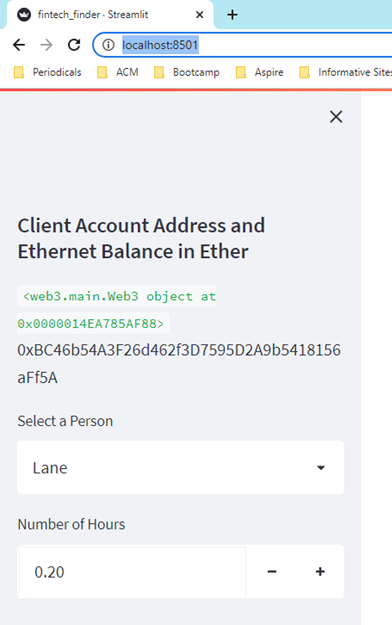
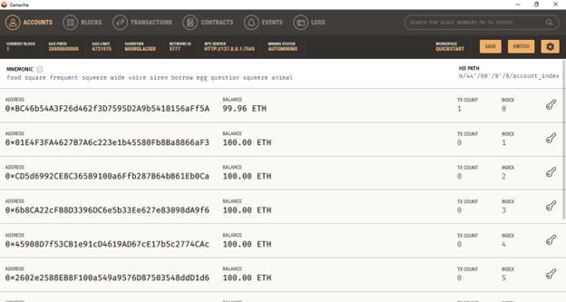
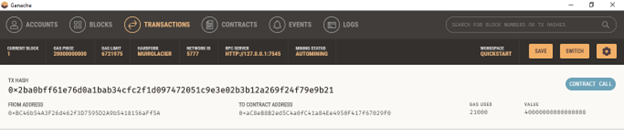
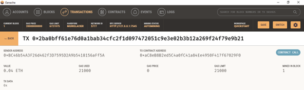

# 19-sending-cryptocurrency-payments

In this challenge, I assumed the role of a lead developer tasked with integrating the Ethereum blockchain network into an application that enables customers to instantly pay fintech professionals whom they hire with cryptocurrency. I completed the code that enables the cryptocurrency payments to be sent. 

To complete this Challenge, I used two Python files. The first file is called fintech_finder.py. It contains the code associated with the web interface of the  application. The code included in this file is compatible with the Streamlit library. I wrote all of the code in this file. The second file I used is called crypto_wallet.py. This file contains the Ethereum transaction functions. By using import statements, I integrated the crypto_wallet.py Python script into the interface program that is found in the fintech_finder.py file.

Integrating these two files allowed me to automate the tasks associated with generating a digital wallet, accessing Ethereum account balances, and signing and sending transactions via Ganache. Specifically, I assumed the perspective of a customer to do the following:

(1) Generated a new Ethereum account instance by using the mnemonic seed phrase provided by Ganache.

(2) Fetched and displayed the account balance associated with your Ethereum account address.

(3) Calculated the total value of an Ethereum transaction, including the gas estimate, that pays a candidate for their work.

(4) Digitally signed a transaction that pays a candidate, and sent this transaction to the Ganache blockchain.

(5) Reviewed the transaction hash code associated with the validated blockchain transaction.

Once I received the transaction’s hash code, I navigated to the Transactions section of Ganache to review the blockchain transaction details. To confirm that I successfully created the transaction, I saved screenshots (see below).  

## Installation Guide

The following package needs to be installed into the development environment.

```python
!pip install streamlit
!pip install dataclasses
```
---

## Technologies

This project leverages python 3.7 with the following libraries and dependencies:

* [pandas](https://github.com/pandas-dev/pandas) - For manipulating data

* [streamlit](https://github.com/streamlit/streamlit) - The fastest way to build and share data apps.

* [web3](https://github.com/ethereum/web3.py) - A Python library for interacting with Ethereum
---

### **Step 1: Imported Ethereum Transaction Functions into the Fintech Finder Application**

In this section, I imported several functions from the crypto_wallet.py script into the file fintech_finder.py, which contains code for the customer interface, in order to add wallet operations to the application. For this section, I assumed the perspective of a customer (i.e., I provided my Ethereum wallet and account information to the application).

To do so, I completed the following steps:

(1) Reviewed the code contained in the `crypto_wallet.py` script file. The Ethereum transaction functions built throughout this module—including `wallet`, `wallet.derive_acount`, `get_balance`, `fromWei`, `estimateGas`, `sendRawTransaction`, and others—were incorporated into Python functions that allowed me to automate the process of accessing them.

(2) Added my mnemonic seed phrase (provided by Ganache) to the starter code’s `SAMPLE.env` file. When the information was added, renamed the file `.env`.

(3) Opened the `fintech_finder.py` file. Toward the top of the file, after the import statements were provided, imported the following functions from the `crypto_wallet.py` file:

    (a) generate_account
    (b) get_balance
    (c) send_transaction

(4) Within the Streamlit sidebar section of code, created a variable named `account`. Set this variable equal to a call on the `generate_account` function. This function created the customer’s (in this case mine) HD wallet and Ethereum account.

(5) Within this same section of the `fintech_finder.py` file, defined a new `st.sidebar.write` function that displayed the balance of the customer’s account. Inside this function, called the `get_balance` function and passed it to my Ethereum `account.address`.

### **Step 2: Signed and Execute a Payment Transaction**

Next, I wrote the code to calculate a fintech professional’s wage, in ether, based on the worker’s hourly rate and the number of hours that they work for a customer. (The fintech professionals’ hourly rates were provided in the `candidate_database` that is found in `fintech_finder.py`.)

I then wrote code that uses the calculated wage value to send a transaction that pays the worker. This code should allow the customer to authorize the transaction with their digital signature. For the purpose of testing out this application, I used my own Ethereum account information as the customer account information.

To accomplish this, I completed the following steps:

(1) Since customers are to select a fintech professional from the application interface’s drop-down menu, and then input the amount of time for which they’ll hire the worker, I coded the application so that once a customer completes these steps, the application calculated the amount that the worker will be paid in ether. To do so, completed the following:

(A) Wrote the equation that calculates the candidate’s wage. This equation assessed the candidate’s hourly rate from the candidate database (`candidate_database[person][3]`) and then multiplied this hourly rate by the value of the `hours` variable. Saved this calculation’s output as a variable named `wage`.

(B) Wrote the `wage` variable to the Streamlit sidebar by using `st.sidebar.write`.

(2) Wrote the code that allows a customer (me, in this case) to send an Ethereum blockchain transaction that pays the hired candidate. To accomplish this, located the code that read `if st.sidebar.button("Send Transaction")`. Added logic to this if statement that sends the appropriate information to the `send_transaction` function (imported from the `crypto_wallet` script file). Inside the `if` statement, added the following functionality:

(A) Called the `send_transaction` function and passed it three parameters:

(B) Ethereum `account` information. (this `account` instance was created when the `generate_account` function was called.) From the `account` instance, the application accesses the `account.address` information that is needed to populate the `from` data attribute in the raw transaction.

(C) The `Candidate_address` (which is created and identified in the sidebar when a customer selects a candidate). This populates the `to` data attribute in the raw transaction.

(D) The `wage` value. This passed to the `toWei` function to determine the wei value of the payment in the raw transaction.

(E) Saved the transaction hash that the `send_transaction` function returns as a variable named `transaction_hash`, and had it display on the application’s web interface.
    
### **Step 3: Inspected the Transaction**

Here, I tested the application with the integrated Ethereum wallet. I sent a test transaction by using the application’s web interface, and then looked up the resulting transaction in Ganache. To do so, I completed the following steps:

(1) From the terminal, navigated to the project folder that contains my .env file and the fintech_finder.py and crypto_wallet.py files.

(2) Launched the Streamlit application, typed streamlit run fintech_finder.py.

(3) On the resulting webpage, selected a candidate that I would like to hire from the appropriate drop-down menu. Then, entered the number of hours that I would like to hire them for. 

*  

    Screenshot of selected candidate on streamlit 

(4) Clicked the Send Transaction button to sign and send the transaction with my Ethereum account information. Navigated to the Transactions section of Ganache.

*  

    Screenshot of my address balance and history on Ganache. 

*  

    Screenshot of the transaction details on Ganache. 

(5) Returned to the original transaction, and clicked the transaction’s To address.

*  

    Screenshot of the recipient’s address balance and history in the Ganache application. 
    
---
## Contributors

Brought to you by Wilson Rosa. https://www.linkedin.com/in/wilson-rosa-angeles/.

---
## License

MIT